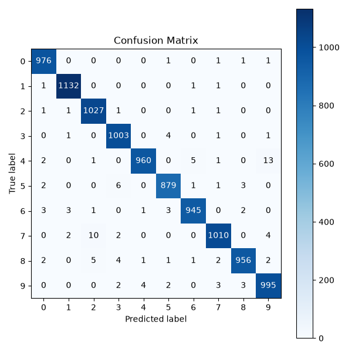
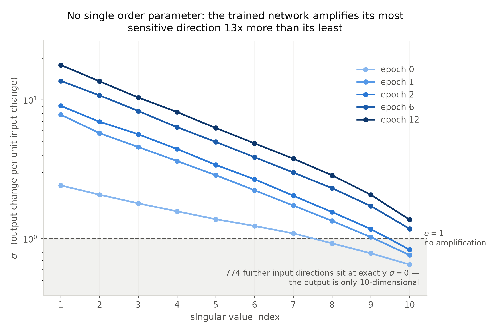
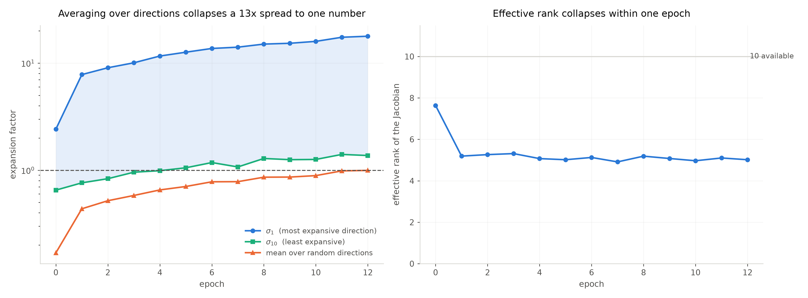
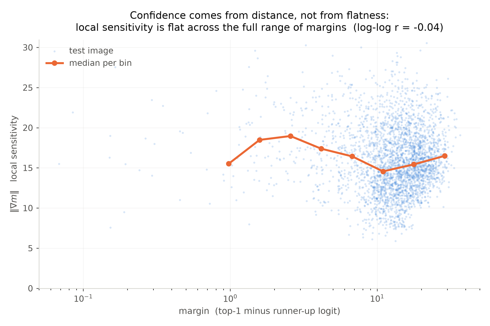

## Building Interpretability Intuition from Scratch

A LeNet-ish CNN for MNIST, implemented from scratch in raw NumPy — no autograd, no `nn.Module`. Every forward and backward pass was derived and hand-coded to build real mechanical understanding of how a CNN works, as groundwork for the interpretability questions this project exists to ask.

### Architecture

```
Input        28×28×1
Conv1        6 filters, 5×5, stride 1     → 24×24×6
ReLU
MaxPool      2×2, stride 2                → 12×12×6
Conv2        16 filters, 5×5, stride 1    → 8×8×16
ReLU
MaxPool      2×2, stride 2                → 4×4×16
Flatten                                   → 256
FC1          256 → 120
ReLU
FC2          120 → 84
ReLU
FC3          84 → 10
Softmax + Cross-Entropy loss
```


Convolution runs via im2col + matmul (vectorized with `sliding_window_view`, no Python loop over patches). Plain mini-batch SGD, no learning rate schedule, momentum, or regularization.

### Where things stand

The full pipeline is built and working: data loading and preprocessing, every layer (`Dense`, `ReLU`, `SoftmaxCrossEntropy`, `Flatten`, `MaxPool2D`, `Conv2D` with `im2col`/`col2im`), the `Sequential` container, `SGD`, a training loop with best-checkpoint saving, and evaluation with a confusion matrix.

Every layer's hand-derived backward pass has been checked against numerical (finite-difference) gradients, and the fully wired model was confirmed to overfit a 10-image batch to 100% train accuracy before any real training run.

Trained on the full 55k-image training set (`run_training.py`), the model reaches **98.9% accuracy on the untouched 10k test set**. An earlier run stalled at 87% purely because the learning rate was too low — at `lr=0.1` the first epoch alone already beats that, and validation loss bottoms out around epoch 11 before overfitting sets in, so the best-checkpoint logic matters.

The remaining errors concentrate on a handful of familiar pairs: 4→9 (13 cases), 7→2 (10), 5→3 (6). Digit 4 has the weakest recall at 97.8%; 0 and 1 are near-perfect. The 7→2 confusion is notably asymmetric — 7s get called 2s ten times, but 2s get called 7s only once.



### Looking inside

Two visualizations exist so far, both built on the same block layout as the architecture diagram:

- **`plot_filters`** — Conv1's six 5×5 kernels drawn directly as images. No forward pass needed; these are fixed weights, showing what each filter looks *for*.
- **`plot_activations`** — a real forward pass on one example, with every cell colored by its actual activation value (per-layer normalization, post-ReLU where a ReLU follows). `plot_activations_grid` does this for one example of each digit 0–9 side by side, for comparing how the same layers respond across classes.

Hidden dense layers are computed but not drawn: a neuron's index in FC1/FC2 is arbitrary, so a column of 120 dots shows sparsity and little else. Only the final 10 logits, which have fixed known meanings, get plotted.

### Input–output sensitivity

The question that started this: does the network show anything like a critical point?

There's a reason to expect one. He initialization sets σ_w² = 2/fan_in, and for ReLU that is *exactly* the condition where perturbations neither grow nor shrink as they propagate — the mean-field critical point. Not a coincidence (He init was derived from variance preservation, which is the same equation), but it means the network starts life critical by construction. The question was what training does to that.

Everything below was measured by nudging an input and watching how far the output moved. `criticality.py`, `directional.py`, `spectrum_viz.py`.

**There is no single expansion factor.** In the trained network the Jacobian's singular values run from 1.37 to 17.8 — a 13× range depending purely on which direction you push — plus 774 further input directions that produce no output change at all, since the output is only 10-dimensional. A scalar order parameter has nowhere to sit.



**The apparent drift toward criticality was an artifact of averaging.** Averaged over random directions, sensitivity climbs from 0.21 to 1.05 over training and crosses 1 near the end, which reads like a system approaching a critical point. It isn't. The average sits in the middle of a spectrum fanning out in both directions, and summarising that spread with one number is what created the illusion. The quantity that does change sharply is effective rank, which collapses from 7.6 to 5.0 within a single epoch and then stays flat — the network picks which directions matter almost immediately, and the remaining eleven epochs only scale them up.



**Confidence comes from distance, not from flatness.** The working hypothesis was that the network would be locally calmer around inputs it classifies confidently. It isn't. Gradient norms are near-identical for the most and least confident predictions (17.2 vs 18.3) while their margins differ 18-fold, so the entire difference is *position* — confident inputs sit far from the decision boundary, not in flatter regions. Log-log correlation between margin and local sensitivity: −0.04.



A methodological note worth recording: the first version of this measurement used random perturbation directions and found nothing at all. In 784 dimensions a random direction has cosine ≈ 1/√784 with any specific one, so it barely touches the subspace that matters. Switching to the gradient of the top-two logit gap — the steepest boundary-crossing direction — produced a signal 15× larger. The instrument was blind, not the network uninteresting.

**What this does not show.** No control parameter was swept. Every measurement above tracks a single training trajectory, and epoch is not something you can dial up and down, hold fixed, and re-measure. Criticality is a property of a system at a particular point in a tunable parameter, so none of this establishes or refutes one. What it does establish is that the trained network's input map is strongly anisotropic, and that scalar summaries of it mislead.

### Next

Looking for a **white-box measure of generalization**: something computable from the weights and their development over training, without ever touching a test set.

Testing that needs models whose generalization actually differs, so the plan is a label-noise sweep — train on a fixed small subset with 0%, 25%, 50%, 75%, and 100% of labels randomized. All of them reach 100% training accuracy with identical architecture and parameter count; only the amount of real structure available to learn differs. Any weight-only quantity that separates them is measuring something beyond capacity.

Candidates, cheapest first: distance from initialization (the epoch-0 snapshots already exist), stable rank, singular-value entropy, and the power-law tail exponent of each layer's eigenvalue spectrum. Validation is rank correlation against true test accuracy across the sweep — with enough models that a strong correlation can't be coincidence, and a check that whatever works isn't just tracking weight norm.
