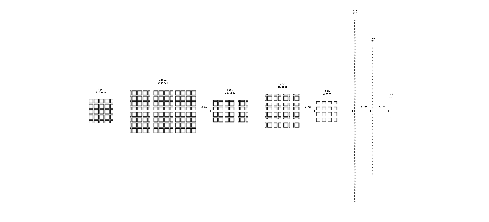

## Building Interpretability Intuition from Scratch

A LeNet-ish CNN for MNIST, implemented from scratch in raw NumPy — no autograd, no `nn.Module`. Every forward and backward pass was derived and hand-coded to build real mechanical understanding of how a CNN works, as groundwork for the interpretability questions this project exists to ask.

### Architecture

```
Input        28×28×1
Conv1        6 filters, 5×5, stride 1     → 24×24×6
ReLU
MaxPool      2×2, stride 2                → 12×12×6
Conv2        16 filters, 5×5, stride 1    → 8×8×16
ReLU
MaxPool      2×2, stride 2                → 4×4×16
Flatten                                   → 256
FC1          256 → 120
ReLU
FC2          120 → 84
ReLU
FC3          84 → 10
Softmax + Cross-Entropy loss
```



Convolution runs via im2col + matmul (vectorized with `sliding_window_view`, no Python loop over patches). Plain mini-batch SGD, no learning rate schedule, momentum, or regularization.

### Where things stand

The full pipeline is built and working: data loading and preprocessing, every layer (`Dense`, `ReLU`, `SoftmaxCrossEntropy`, `Flatten`, `MaxPool2D`, `Conv2D` with `im2col`/`col2im`), the `Sequential` container, `SGD`, a training loop with best-checkpoint saving, and evaluation with a confusion matrix.

Every layer's hand-derived backward pass has been checked against numerical (finite-difference) gradients, and the fully wired model was confirmed to overfit a 10-image batch to 100% train accuracy before any real training run.

A full run on the 55k-image training set currently reaches **87.1% accuracy** on the 5k validation set — below the 95% target, but the errors aren't random: they concentrate on the classic ambiguous MNIST pairs (4/9, 3/5, 3/8), which points to under-training rather than a bug. Next step is tuning epochs/learning rate before touching the architecture.

### Next

Moving into the actual point of the project: probing what the trained network represents. The current code caches what each layer needs for its own backward pass, but not much more — before running interpretability experiments it needs stable layer naming, a way to pull activations without them being overwritten by unrelated forward passes (e.g. validation runs during training), and persistence of activations/weights across training steps rather than just a single best-checkpoint.
